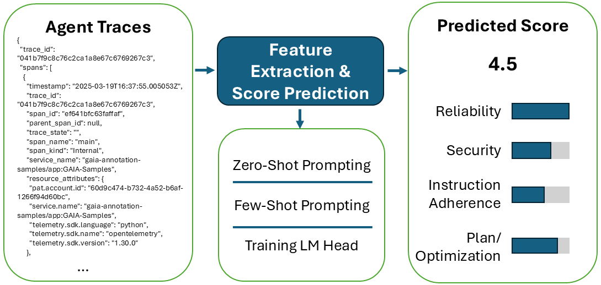

# Swarm Agent Evaluation

This repository contains lightweight tooling and experiments for evaluating large-language-model agents. It was created as part of the **Data Science Lab at ETH Zurich**, with the generous support of **Beekeeper**.

  

## What’s here
- `prompting/`: prompt templates plus async callers for OpenAI with caching helpers.
- `utils.py`: convenience helpers to run evaluations against model endpoints and extract traces and error codes.
- `predictions/`: saved JSONL outputs from evaluation runs.
- `plots/`: visualizations of error distributions and cross-validation scores.
- `experiments/`: notebooks used for analysis and quick visual checks.

## Notes
- Set your API key as environment variable (`OPENAI_API_KEY`) before running anything that calls models.

- Prediction logs in `predictions/` and plots in `plots/` are for reference and benchmarking.

## License
MIT License (see `LICENSE`).
